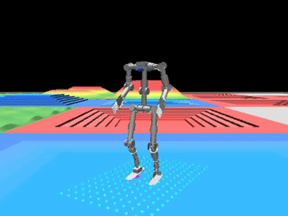
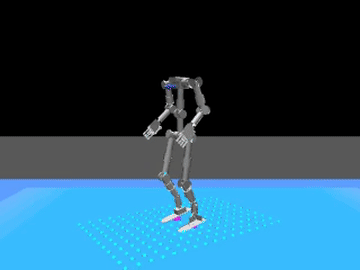
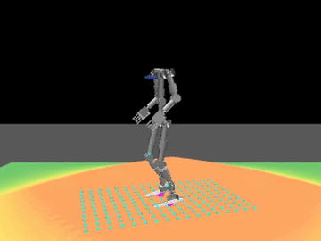
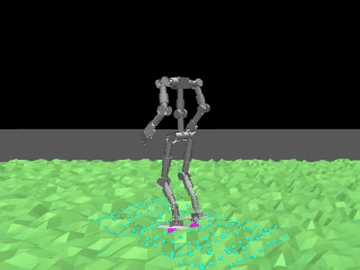
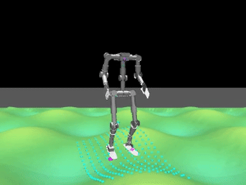

# Walka RL Mjlab


*Trained Walka-Flat policy: a stable forward walking gait in sim*



*Trained Walka-Rough policy: walking across the procedural rough-terrain curriculum grid*

`Walka-Flat` has been trained end-to-end on a rented vast.ai RTX 4090
(10001 iterations, `num_envs=4096`, ~1h54m, no OOM) — that's the first
gait above. `Walka-Rough` has also been trained on a rented RTX 4090
(9900 iterations, `num_envs=2048`, ~4h33m, terrain generator + raycast
height-scan sensor) — the second gait, on the curriculum grid described in
`docs/vast_ai_training.md`.

### Terrain gallery

`ROUGH_TERRAINS_CFG` mixes 7 sub-terrain types into one curriculum grid;
here's the same `Walka-Rough` checkpoint isolated on four of them
(`scripts/play.py Walka-Rough --terrain <name> --forward-speed 0.7`, which
forces a steady forward command so the robot walks off the flat spawn
platform instead of idling on it):

<table>
<tr>
<td><br/><sub><code>pyramid_stairs</code></sub></td>
<td><br/><sub><code>hf_pyramid_slope</code></sub></td>
</tr>
<tr>
<td><br/><sub><code>random_rough</code></sub></td>
<td><br/><sub><code>wave_terrain</code></sub></td>
</tr>
</table>

## Install

```bash
make sync-cpu   # dev machine without a GPU: uv sync --extra cpu --group dev
make sync       # GPU box, CUDA 12.8: uv sync --extra cu128 --group dev
```

## Usage

```bash
# List all registered tasks.
uv run python scripts/list_envs.py

# Train a policy (swap Walka-Flat for Walka-Rough to train on terrain).
uv run python scripts/train.py Walka-Flat --env.scene.num-envs=4096

# Play back a trained checkpoint in the viewer.
uv run python scripts/play.py Walka-Flat --checkpoint-file logs/rsl_rl/walka_velocity/DATE/model_N.pt

# Steer it yourself (native viewer only): W/S fwd-back, J/L strafe, Q/E turn, X stop.
uv run python scripts/play.py Walka-Rough --checkpoint-file logs/.../model_N.pt --keyboard-steer

# Record a demo clip on one terrain type, walking forward off the spawn platform.
uv run python scripts/play.py Walka-Rough --checkpoint-file logs/.../model_N.pt \
    --terrain random_rough --forward-speed 0.7 --video --no-terminations

# Publish a promoted checkpoint to the Hugging Face Hub.
uv run python scripts/push_to_hub.py --repo-id <user>/walka-velocity-flat --wandb-run-path <entity>/<project>/<run_id>
```

No local GPU needed — see `docs/vast_ai_training.md` for the full
rented-GPU workflow (instance selection, monitoring, promotion bar,
Hugging Face Hub publish).

## Docs

- `docs/reward_design.md` — what each reward term does and how it shapes the gait.
- `docs/vast_ai_training.md` — rented-GPU training workflow.

Repo: <https://github.com/thanhndv212/walka_rl_mjlab>

## Acknowledgements

- [unitree_rl_mjlab](https://github.com/unitreerobotics/unitree_rl_mjlab) —
  this repo's task/script structure mirrors it, and the gait-clock `phase`
  observation and `feet_gait`/`stand_still` rewards
  (`src/tasks/velocity/mdp/`) are ported from its local velocity-task fork.
