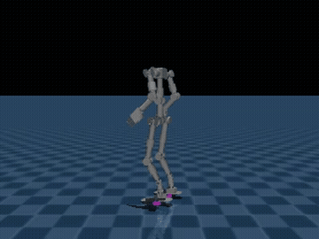

# Walka RL Mjlab



*Trained policy (`model_9900.pt`) walking under a forward velocity command.*

MuJoCo/mjlab port of the IsaacLab-based Walka biped project (`walka_lab`).
Mirrors `unitree_rl_mjlab`'s structure: `scripts/train.py`,
`scripts/play.py`, `scripts/list_envs.py`, task registration under
`src/tasks/**/config/*/__init__.py`.

`Walka-Flat` has been trained end-to-end on a rented vast.ai RTX 4090
(10001 iterations, `num_envs=4096`, ~1h54m, no OOM) — that's the gait
above. `Walka-Rough` is registered but not yet trained.

## Install

```bash
make sync-cpu   # dev machine without a GPU: uv sync --extra cpu --group dev
make sync       # GPU box, CUDA 12.8: uv sync --extra cu128 --group dev
```

## Usage

```bash
uv run python scripts/list_envs.py
uv run python scripts/train.py Walka-Flat --env.scene.num-envs=4096
uv run python scripts/play.py Walka-Flat --checkpoint-file logs/rsl_rl/walka_velocity/DATE/model_N.pt
uv run python scripts/push_to_hub.py --repo-id <user>/walka-velocity-flat --wandb-run-path <entity>/<project>/<run_id>
```

No local GPU needed — see `docs/vast_ai_training.md` for the full
rented-GPU workflow (instance selection, monitoring, promotion bar,
Hugging Face Hub publish).

## Viewing the robot

```bash
# Standing on a zero-action policy (mjpython required for the native viewer on macOS).
.venv/bin/mjpython scripts/play.py Walka-Flat --agent=zero --viewer=native

# Raw geometry only, falls under gravity immediately.
uv run python -m mujoco.viewer --mjcf=src/assets/robots/walka/xmls/walka.xml

# Pelvis welded to world + per-joint sliders, for inspecting joint ranges.
uv run python tools/view_fixed_base.py
```

## Regenerating the MJCF

```bash
uv run python tools/convert_urdf_to_mjcf.py /path/to/urdf_export_dir
```

Takes a URDF + OBJ mesh export and writes
`src/assets/robots/walka/xmls/walka.xml` + meshes. See the module
docstring for what it adds beyond a literal URDF import.

## Docs

- `docs/reward_design.md` — what each reward term does and how it shapes the gait.
- `docs/vast_ai_training.md` — rented-GPU training workflow.
- `docs/kinematic_structure_analysis.md` — MJCF kinematic issues found and fixed.

Repo: <https://github.com/thanhndv212/walka_rl_mjlab>
