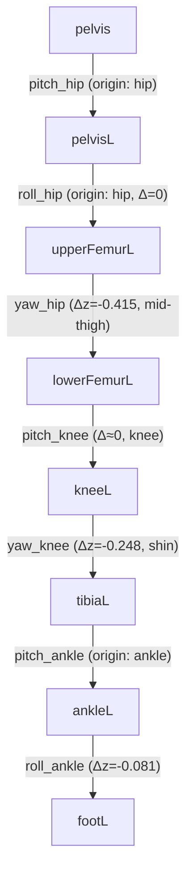
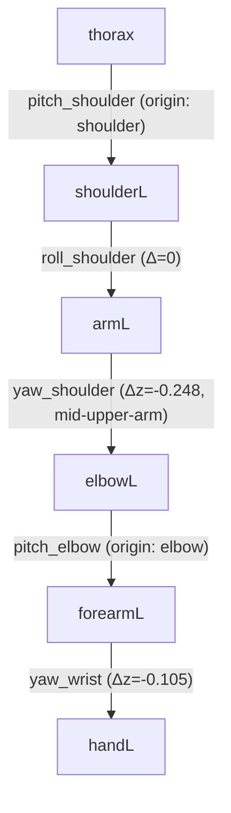

# Walka kinematic structure analysis: redundant joints & joint placement

Status: **implemented** — Option B (§9), not Option A as originally
recommended in §5. `yaw_hip`'s placement and the L/R limit asymmetry (§1.2,
§1.3) are unchanged, still open.
Source data: `~/Downloads/v1_newjointlim/jackbot_v1.urdf` (converted by
`tools/convert_urdf_to_mjcf.py` into `src/assets/robots/walka/xmls/walka.xml`).

## 1. Summary

The URDF's 26 revolute joints are a reasonable DOF budget at the top level
(3-DOF hip, 2-DOF ankle, 3-DOF shoulder — all standard for a humanoid). But
tracing the actual joint origins and axes (not just counting joints) surfaces
two structural issues in the leg (mirrored in the arm) and one data
inconsistency:

1. **`yaw_hip` and `yaw_knee` are two parallel-axis twist joints in series**,
   separated only by the knee's pitch hinge — kinematically near-redundant
   for locomotion, and `yaw_knee` alone is already atypical for a bipedal
   walker (G1/H1/Cassie/Digit-class robots model the knee as pure pitch).
2. **`yaw_hip` isn't co-located with `pitch_hip`/`roll_hip`** — it sits
   0.415 m down the thigh, at the same place `yaw_knee` sits (0.248 m
   further down). So this isn't a true 3-DOF spherical hip; it's a 2-DOF hip
   plus a separate mid-thigh twist joint that only rotates the shank
   assembly. Same pattern at the shoulder (`yaw_shoulder` offset 0.248 m
   down the upper arm).
3. **L/R joint limits are inconsistently mirrored**, and specifically only
   for the two joints above — `roll_hip` and `roll_shoulder` mirror
   correctly, `yaw_hip` and `yaw_knee` do not. This looks like a CAD/URDF
   export artifact rather than an intentional asymmetric design.

Recommendation: lock `yaw_knee` (both sides) during MJCF generation, keep
`yaw_hip`, and flag the `yaw_hip` limit asymmetry for verification against
the source mechanical design before trusting it. Full plan in §5.

## 2. Methodology

Read `jackbot_v1.urdf` directly (`<joint>` elements: `origin xyz`, `parent`/
`child`, `axis`, `limit lower/upper`) rather than relying on joint names or
counts alone, and traced each limb's chain: which joints share an origin
(co-located, i.e. offset 0 from their sibling), which are offset down the
next link, and by how much. Cross-checked left/right limit values against
each other for the mirroring a bilaterally symmetric biped should have.

## 3. Current structure

### Leg chain (left; right is the mirror image with the same topology)

`pitch_hip` and `roll_hip` share an origin (both `Δ=0` relative to their
parent body) — a proper 2-axis intersection at the hip. `yaw_hip` is the
outlier: offset 0.415 m down the femur, i.e. co-located with where
`yaw_knee` sits (offset a further 0.248 m down), not with the other two hip
axes.

### Arm chain (left; right mirrors)

Same pattern: `yaw_shoulder` is offset down the upper arm rather than
co-located with `pitch_shoulder`/`roll_shoulder`.

### DOF budget

| Segment | DOF | Axes | Notes |
|---|---|---|---|
| Hip (×2) | 3 | pitch, roll, yaw | standard for a biped |
| Knee (×2) | 2 | pitch, yaw | **yaw is atypical** — most bipeds are pitch-only |
| Ankle (×2) | 2 | pitch, roll | standard |
| Shoulder (×2) | 3 | pitch, roll, yaw | standard |
| Elbow (×2) | 1 | pitch | standard |
| Wrist (×2) | 1 | yaw only | already minimal, not a concern |
| Waist | 2 | pitch, yaw | standard (no roll) |
| **Total** | **26** | | |

### Joint limits: mirroring check

| Joint | Left range | Right range | Mirrors correctly? |
|---|---|---|---|
| `pitch_hip` | −180°/0° | −180°/0° | ✅ (sagittal, should match not mirror) |
| `roll_hip` | −30°/+90° | −90°/+30° | ✅ mirrored |
| `yaw_hip` | 0°/+180° | −90°/+90° | ❌ same span, different center |
| `pitch_knee` | −10°/+100° | −10°/+100° | ✅ (sagittal) |
| `yaw_knee` | 0°/+180° | −90°/+90° | ❌ same asymmetry as `yaw_hip` |
| `roll_shoulder` | 0°/+180° | −180°/0° | ✅ mirrored |
| `yaw_shoulder` | −180°/+180° | −180°/+180° | ✅ (symmetric range, no mirroring needed) |

The asymmetry is isolated to exactly the two joints already flagged as
structurally odd (§3's mid-limb-offset joints) — not spread evenly across
all joints. That specificity is what makes this look like an authoring
artifact tied to those two joints, rather than noise.

## 4. Why this matters for RL training

- **Larger action/observation space than the task needs.** Every locked DOF
  removed shrinks `ActionManager`'s action dim, the joint-space observation
  terms, and the per-joint `pose` reward std table PPO has to learn over —
  smaller, better-conditioned search space, faster convergence, all else
  equal.
- **Near-null-space DOF is a known PPO pain point.** Two parallel-axis
  joints that mostly sum to the same effect (foot heading) give the policy
  two ways to reach similar outcomes with no strong reward gradient
  distinguishing them — this tends to show up as slow-to-settle or noisy
  joint trajectories on the redundant pair, not a training blocker but added
  noise for no locomotion benefit.
- **More self-collision surface to tune around.** `yaw_knee`'s reachable
  range (0–180° on the left) is large enough to be a plausible contributor
  to some of the extreme-pose self-collision pairs found in the earlier
  contact sweep (kneeL/kneeR, kneeL/lowerFemurR, etc. — see the sweep in the
  MJCF-conversion work) — one fewer DOF to swing through a bad range.
- **Correctness risk from the limit asymmetry.** If `yaw_hip`'s left/right
  limits really are meant to be independent (e.g. reflecting a genuine
  hardware asymmetry), leaving them as-is is correct. If they're an export
  artifact, training against the wrong range either clamps away real,
  useful motion on one side or lets the policy exploit an unintended range
  on the other. This should be confirmed against the source design, not
  guessed.

## 5. Proposed solutions

### Option A — Lock `yaw_knee` (both sides) at the MJCF-generation step (recommended)

Remove the `<joint>` element for `L_yaw_knee_joint` / `R_yaw_knee_joint`
when building `walka.xml`, leaving `kneeL`/`tibiaL` (and the right
equivalents) rigidly welded at their current relative pose (0 rad, i.e. the
URDF's zero configuration for that joint — a neutral, unbent-shin position).
This is the same kind of edit `tools/convert_urdf_to_mjcf.py` already does
for the URDF's `jackbot`/`base_link`/`pelvis` fixed-joint chain (deleting a
joint element that shouldn't be an independent DOF), just applied one level
further down the leg.

- **Pros**: lowest risk, fully reversible (it's a generation-time choice,
  not a URDF edit), immediately cuts 26→24 DOF, addresses the clearest
  redundancy without touching `yaw_hip` (which is the joint actually worth
  keeping if only one twist DOF survives).
- **Cons**: if `yaw_knee` turns out to matter for some motion this project
  needs later (unlikely for a velocity-tracking gait, more plausible for
  e.g. deliberate foot-placement tasks), it's gone until re-enabled.

### Option B — Remove the joint and fuse the bodies

Same effect as A, but also merge `kneeL` into `tibiaL` as one body (recompute
combined mass/inertia) rather than leaving two welded bodies. Cleaner
long-term (fewer phantom bodies in `model.nbody`), but more invasive and not
necessary — MuJoCo handles welded bodies in a kinematic chain fine as-is (no
correctness cost, just a slightly larger `nbody`).

### Option C — Couple `yaw_knee` to `yaw_hip` via an equality constraint

Keep both as real joints but add a MuJoCo `<equality><joint>` constraint so
`yaw_knee` tracks a fixed ratio of `yaw_hip` (or vice versa), reducing
*effective* DOF without removing the physical joint. More complex to reason
about and tune (need to pick a sensible ratio) for no clear benefit here —
mentioned for completeness, not recommended.

### Option D — Leave both joints, just fix the L/R limit asymmetry

Doesn't address the redundancy finding at all, only the data-consistency
one. Useful as a *minimum* fix if there's a reason to keep `yaw_knee` (e.g.
confirmation from the mechanical design that it's real and load-bearing),
but doesn't get the action-space/self-collision benefits of Option A.

**Recommendation: Option A**, plus fixing `yaw_hip`'s limit asymmetry
(kept, not removed) once the correct range is confirmed against the source
design — don't guess a mirrored range and silently apply it; flag it and
verify (see §7 open question).

## 6. Implementation plan

Changes needed in this repo if Option A is approved:

1. **`tools/convert_urdf_to_mjcf.py`**: add a `LOCKED_JOINTS =
   ("L_yaw_knee_joint", "R_yaw_knee_joint")` list (same pattern as the
   existing `STRUCTURAL_OVERLAP_PAIRS`), and after building the pelvis
   subtree, find and remove those two `<joint>` elements from their bodies
   before writing `walka.xml`. Document the rationale in the module
   docstring, same as the other conversion decisions already documented
   there.
2. **`src/assets/robots/walka/walka_constants.py`**: no code change
   required — `WALKA_KNEE_ACTUATOR`'s `target_names_expr=(".*_knee_joint",)`
   will simply stop matching `yaw_knee` once its joint no longer exists
   (only `pitch_knee` remains a real joint). Worth a comment noting this is
   now pitch-only.
3. **`src/tasks/velocity/config/walka/env_cfgs.py`**: **must** remove the
   `r".*yaw_knee_joint"` entries from `cfg.rewards["pose"].params[
   "std_walking"]` and `["std_running"]`. Left in place, these become
   unmatched regex keys once the joint is gone —
   `resolve_matching_names_values` raises `ValueError` on any dict key that
   doesn't match at least one joint, so this isn't optional cleanup, it's a
   required change to avoid a crash at env-build time.
4. **No other hardcoded dimensions to update** — `ActionManager`,
   `ObservationManager`, and the RSL-RL PPO network sizes are all derived
   from the compiled model / env spaces at runtime, not hardcoded to 26.
5. Regenerate `walka.xml` via `uv run python tools/convert_urdf_to_mjcf.py
   ~/Downloads/v1_newjointlim` and re-run the existing contact-sweep +
   fixed-base stability check to confirm nothing regresses (see §7).

## 7. Verification plan

Reuse the same empirical methods already established for this asset:

1. Re-run the per-joint contact sweep (sweep each remaining joint through
   its full range from the resting pose, record colliding body pairs) —
   confirm `STRUCTURAL_OVERLAP_PAIRS` doesn't need new entries and check
   whether any previously-found extreme-pose collisions
   (kneeL/kneeR, kneeL/lowerFemurR, etc.) disappear now that `yaw_knee`
   can't swing.
2. Re-run the fixed-base + position-actuator dynamic stability check (500
   steps, `implicitfast` integrator, matching `mjlab.sim.MujocoCfg`
   defaults) — confirm `qvel` still decays cleanly with no NaNs.
3. Rebuild `Walka-Rough`/`Walka-Flat` through the real `mjlab` pipeline and
   step both for ~100 steps of random actions — confirm no `ValueError` from
   the `pose` reward's std dicts (the required `env_cfgs.py` fix in §6.3),
   no NaNs, stable root height.
4. Confirm the action space actually reports 24 (not 26) via
   `env.action_manager.total_action_dim`.

## 8. Open questions before implementing

- **Is `yaw_knee` a real, load-bearing DOF in the physical robot, or a CAD
  export artifact from a coupled/passive mechanism?** If there's access to
  the original mechanical design or whoever specified `v1_newjointlim`, this
  is worth a quick confirmation before locking it — the recommendation
  above is based on kinematic reasoning from the URDF alone, not knowledge
  of the physical hardware's actual mechanism.
- **What is `yaw_hip`'s intended right-side range?** If mirrored the same
  way `roll_hip`/`roll_shoulder` are, it would be roughly −180°/0° (matching
  the left's 0°/+180° reflected), but that's a guess pattern-matched from
  the other joints, not a confirmed value — don't apply it without
  checking against source data.

## 9. Resolution

Implemented as **Option B**, not Option A: `tools/convert_urdf_to_mjcf.py`'s
`fuse_knee_into_shin` drops the `yaw_knee` joint and fully merges
`tibiaL`/`tibiaR` into `kneeL`/`kneeR` as one body each (not just deleting
the joint and leaving two separately-tracked welded bodies), translating
the absorbed geom and re-parented children by tibia's own offset — no
rotation bookkeeping needed since tibia had no rotation relative to knee
besides the now-removed joint. `nbody`: 28 → 26. `njnt`: 26 → 24.

A from-scratch rebuild using MuJoCo primitives instead of patching this
mesh-based asset was attempted first (co-locating `yaw_hip`/`yaw_shoulder`
properly in the process) and abandoned — not worth trading away the mesh
visual fidelity for.

Required the `env_cfgs.py` fix flagged in §6.3 (removing the now-unmatched
`yaw_knee_joint` regex keys from the `pose` reward's std dicts) — skipping
it does crash at env-build time with `ValueError`, confirmed by hitting it
directly before making the fix.

Verified via §7's plan: contact sweep from the real standing pose finds no
new structural pairs (everything is still extreme-pose-only, same
character as before the fusion); the fixed-base dynamic-stability check
decays cleanly (`max|qvel|`: 0.086 → 0.009 over 500 steps, `ncon=0`
throughout); both `Walka-Rough` and `Walka-Flat` build, reset, and step
100 times with random actions, no NaNs, `action_manager.total_action_dim`
confirmed at 24.

`yaw_hip`'s placement (still mid-thigh, not at the hip) and its right-side
range asymmetry (§8) are unchanged — out of scope for Option B, still open
if this asset gets revisited.
